# Team-CH
The best team :)

# Partie 1
- Se connecter à GitHub.

- Cliquer sur New repository et lui donner nom, description, visibilité, licence

- Aller dans Settings → Collaborators & teams.

- Ajouter les membres de l’équipe comme collaborateurs.

# Partie 2

- Aller dans l'onglet "Issues".

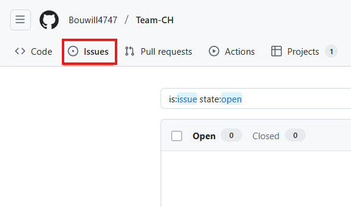

- Cliquer sur "New Issue".

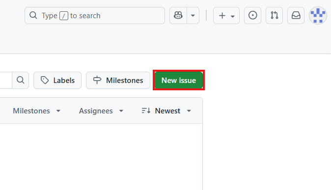

- Rédiger un titre clair et une description.

- Associer l’issue à un Project.

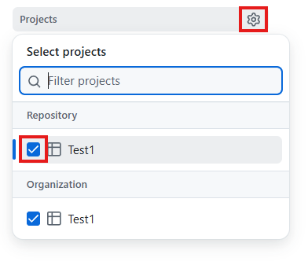

- Définir le status de l’issue → Ready.

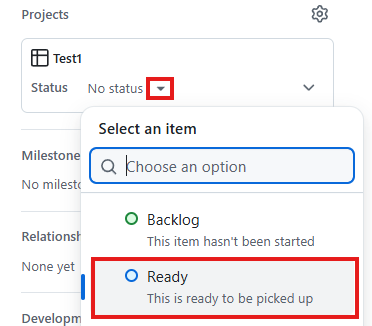

- Associer l’issue à un Milestone.

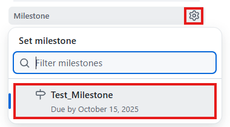

- Définir la priorité avec un label (High, Medium, Low).

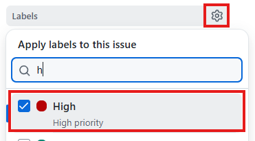

- Créer une branche associée à l’issue.

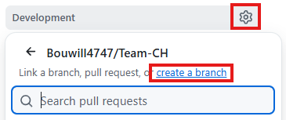
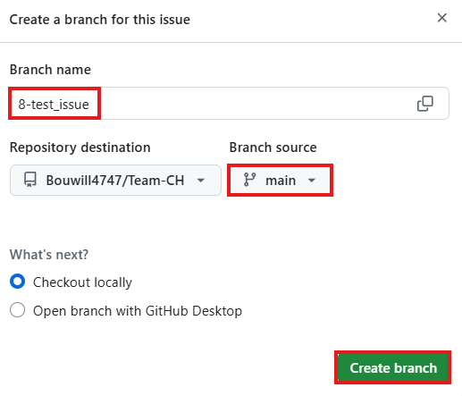

# Partie 3
•	Cloner le repository sur votre machine locale.

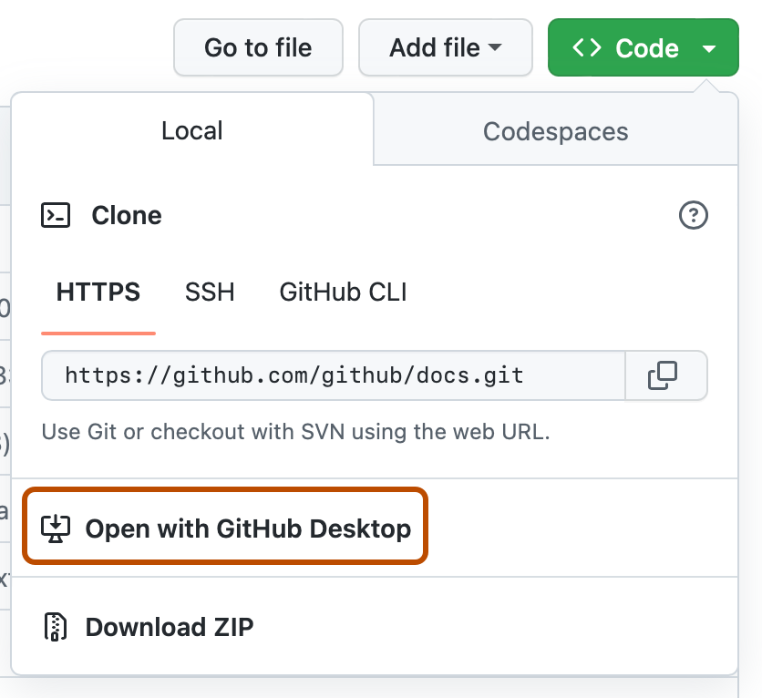

•	Ouvrir le projet dans votre IDE ou GitHub Desktop.

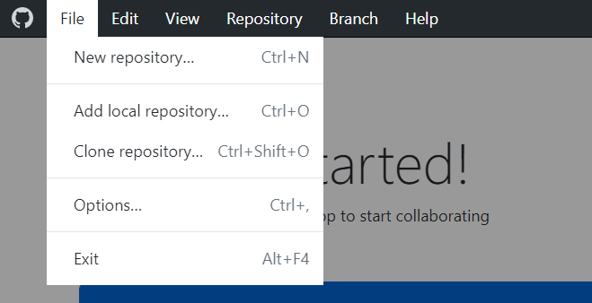

•	Effectuer des modifications dans le code/fichiers.

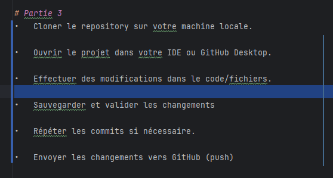

•	Sauvegarder et valider les changements 

•	Répéter les commits si nécessaire.

•	Envoyer les changements vers GitHub (push)

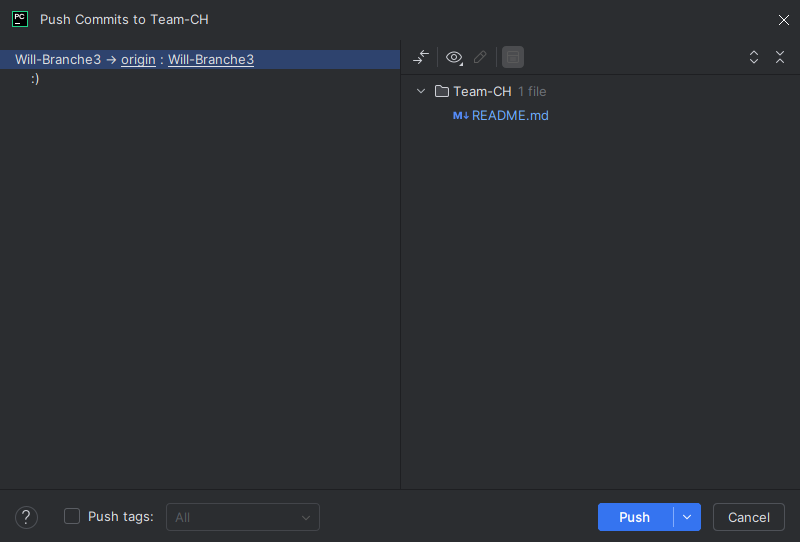

# Partie 4

# Partie 5
