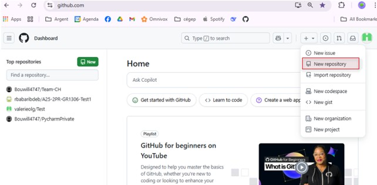
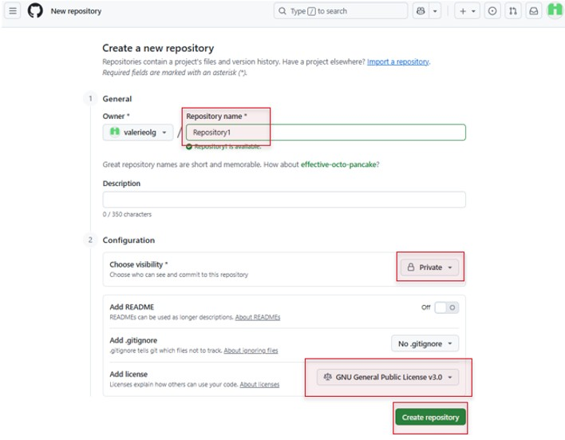
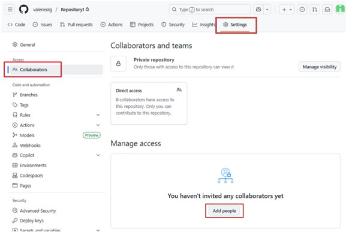

# Team-CH
The best team :)

# Partie 1
- Se connecter à GitHub.

- Cliquer sur New repository et lui donner nom, description, visibilité, licence

- Aller dans Settings → Collaborators & teams.

- Ajouter les membres de l’équipe comme collaborateurs.

# Partie 2

# Partie 3

# Partie 4

# Partie 5