# Projet Bibliothèque
## Description
Module python développé en programmation orientée objet (POO) permettant la gestion complète d’une bibliothèque à l’aide d’un menu interactif en ligne de commande. L’utilisateur peut gérer les adhérents, les documents, les emprunts et la sauvegarde des données de manière dynamique.

Concepts retrouvés : l’encapsulation, l’héritage, le polymorphisme et les classes abstraites.

Modules utilisés : datetime, abc.

---
## Diagramme UML

### Bibliotheque 
Classe centrale :
- elle agrège plusieurs Adherents (relation 1..*),
- elle gère la liste des Documents (relation 1..*),
- elle maintient la liste des Emprunts.

### Adherent 
Classe concrète qui peut être associée à 0 à n emprunts (0..n). Chaque emprunt est lié à un seul adhérent.

### Emprunt
Classe concrète reliant un Adherent à un Livre et contenant les informations temporelles (date_emprunt, date_retour).

### Document
Classe abstraite (ABC) définissant les attributs communs (titre, isbn, quantite) ainsi que les méthodes abstraites liées au type de document et à la gestion des quantités.

### Volume
Classe abstraite intermédiaire héritant de Document, ajoutant l’attribut auteur.

### Journal
Hérite directement de Document et ajoute l’attribut date_publication.

#### Les classes concrètes suivantes héritent de Volume et illustrent le polymorphisme : Livre, BD, Dictionnaire.

---
## Fonctionnement du module
Le programme repose sur une classe centrale Bibliotheque qui agit comme point de contrôle du système. 
Elle conserve :
- la liste des documents,
- la liste des adhérents,
- la liste des emprunts.

Les données de la bibliothèque sont manipulées à l’aide de fichiers CSV, permettant leur lecture et leur écriture pour assurer la persistance des informations.

Un menu interactif permet à l’utilisateur de :
- ajouter ou supprimer des adhérents,
- ajouter ou supprimer des documents,
- emprunter et retourner des livres,
- prolonger un emprunt,
- Sauvegarder les modifications,
- afficher les listes d’adhérents et d’emprunts.

Les dates d’emprunt et de retour sont générées automatiquement, réduisant ainsi les erreurs de saisie.

---
## Exemples d'utilisation
### Menu
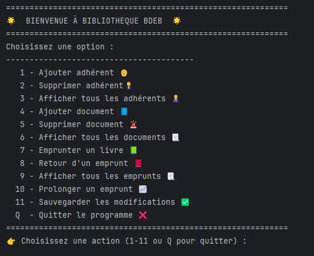
### Ajouter adhérent
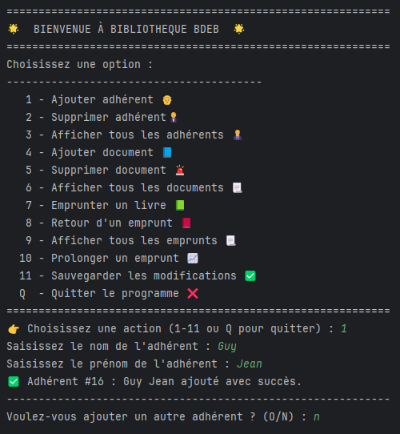
### Supprimer adhérent
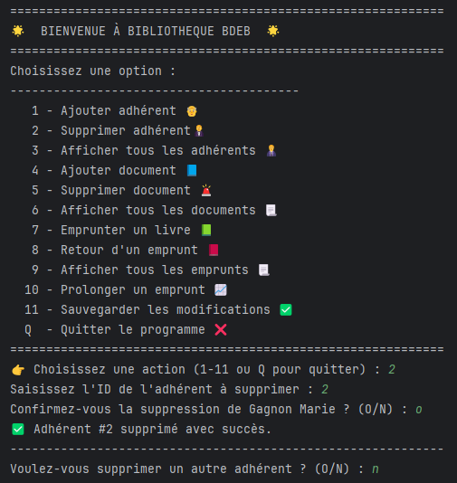
### Afficher tous les adhérents
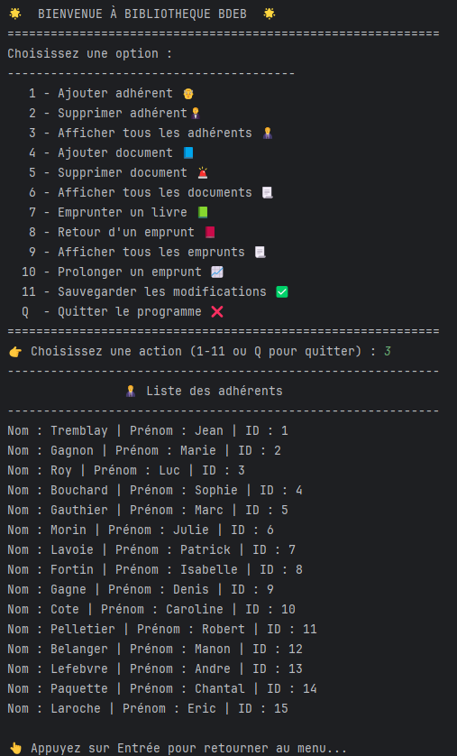
### Ajouter document 
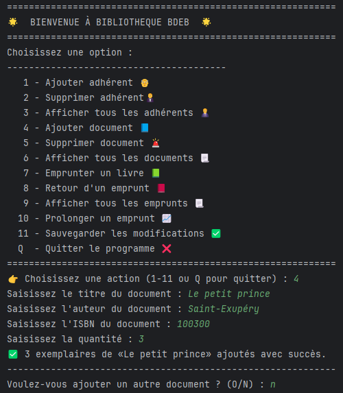
### Supprimer document
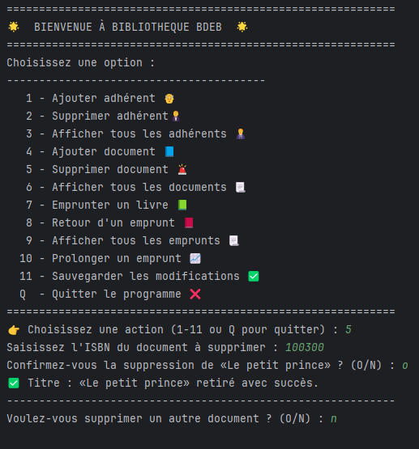
### Afficher tous les documents
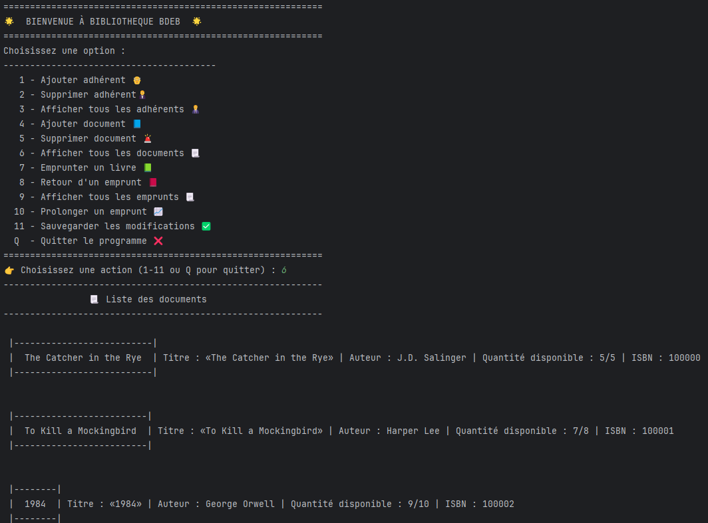
### Emprunter un livre
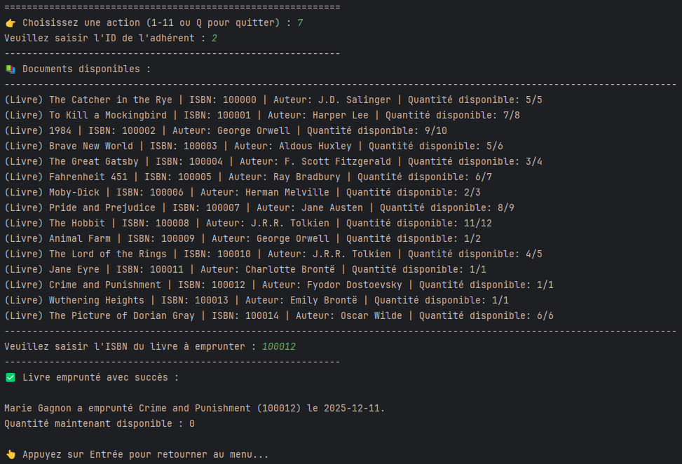
### Retour d'un emprunt
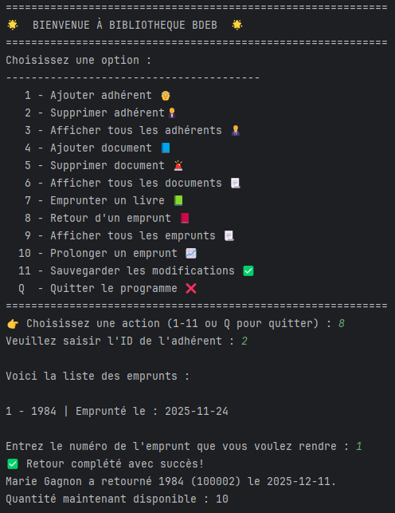
### Afficher tous les emprunts
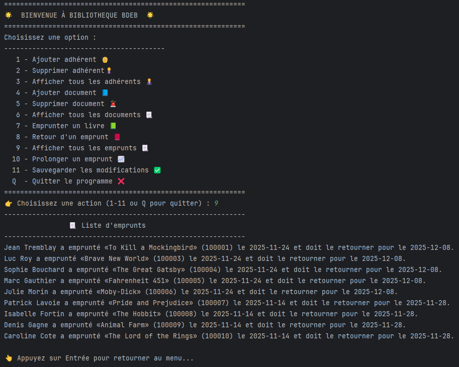
### Prolonger un emprunt
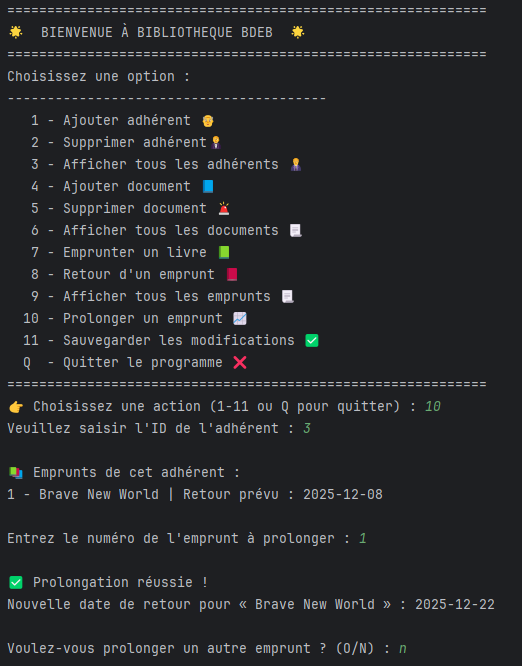
### Sauvegarder les modifications
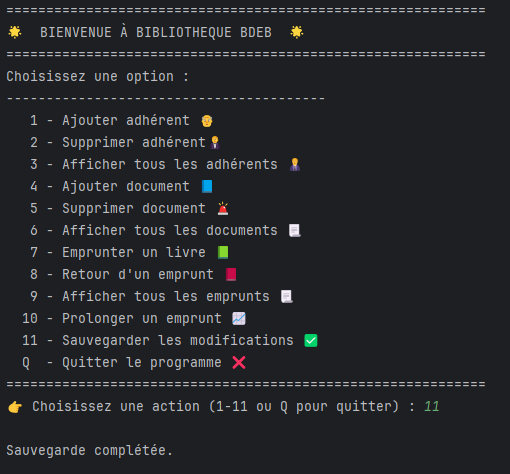
### Quitter le programme 
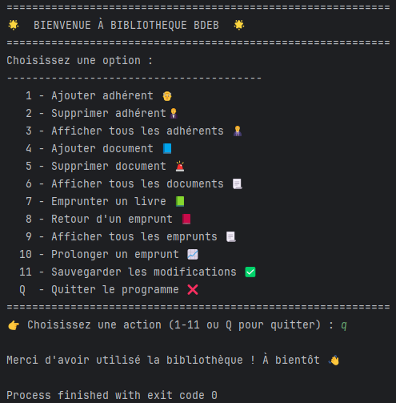
### Prise en charge des erreurs de saisies
Les saisies erronées sont prises en compte par le programme pour l’ensemble des saisies utilisateur. Des messages d’erreur clairs sont affichés et des boucles permettent à l’utilisateur de corriger son entrée sans interrompre l’exécution du programme. 
En voici un exemple :

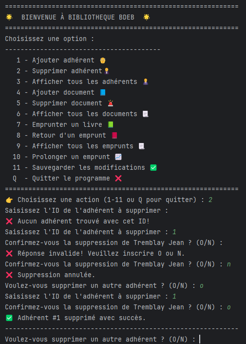

---
## Auteurs
Projet réalisé par Eric De Celles, Valérie Ouellet et William Bourbonnières dans un contexte académique dans le cadre du cours 420-2PR-BB Programmation orientée objet.
Collège Bois-de-Boulogne
14/12/2025