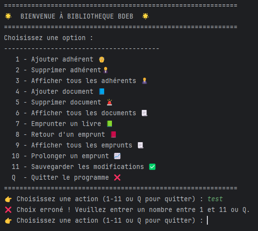
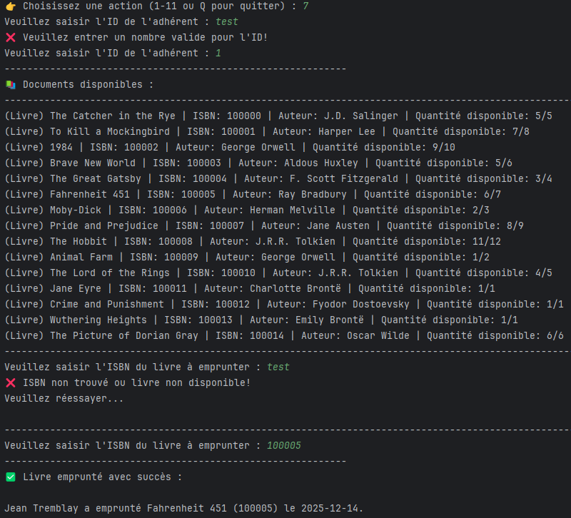
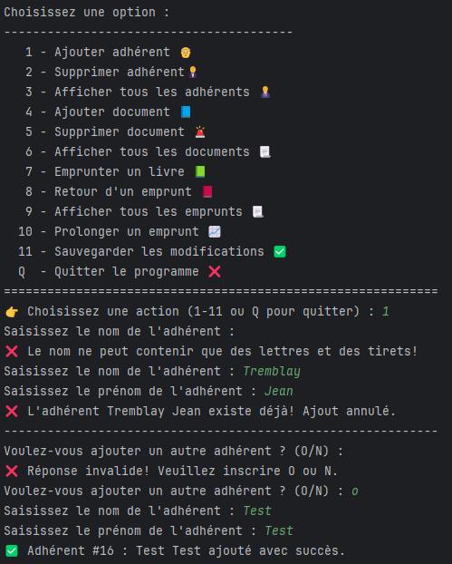
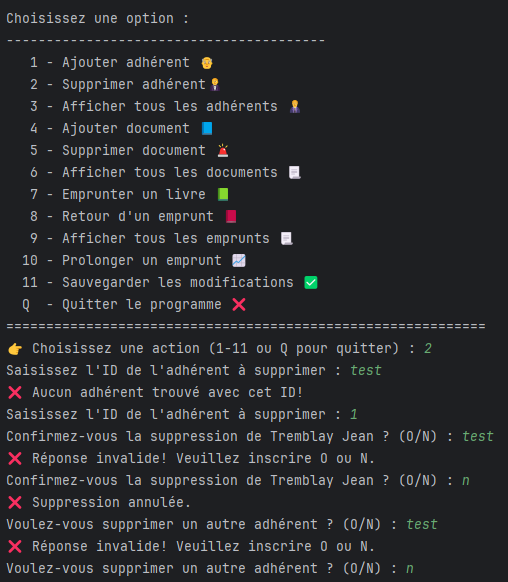

# Projet Bibliothèque
## Description
Module python développé en programmation orientée objet (POO) permettant la gestion complète d’une bibliothèque à l’aide d’un menu interactif en ligne de commande. L’utilisateur peut gérer les adhérents, les documents, les emprunts et la sauvegarde des données de manière dynamique.
Les données de la bibliothèque sont manipulées à l’aide de fichiers CSV, permettant leur lecture et leur écriture pour assurer la persistance des informations.

- Concepts utilisés : l’encapsulation, l’héritage, le polymorphisme et les classes abstraites.

- Modules utilisés : datetime, abc.

---
## Diagramme UML

### Bibliotheque 
Classe centrale :
- elle agrège plusieurs Adherents (relation 1..*),
- elle gère la liste des Documents (relation 1..*),
- elle maintient la liste des Emprunts.

### Adherent 
- Classe concrète qui peut être associée à 0 à n emprunts (0..n). Chaque emprunt est lié à un seul adhérent.

### Emprunt
- Classe concrète reliant un Adherent à un Livre et contenant les informations temporelles (date_emprunt, date_retour).

### Document
- Classe abstraite (ABC) définissant les attributs communs (titre, isbn, quantite) ainsi que les méthodes abstraites liées au type de document et à la gestion des quantités.

### Volume
- Classe abstraite intermédiaire héritant de Document, ajoutant l’attribut auteur.

### Journal
- Hérite directement de Document et ajoute l’attribut date_publication.

### Les classes concrètes suivantes héritent de Volume : 
- Livre,
- BD,
- Dictionnaire.

---
## Fonctionnalités principales
- Gestion des adhérents (ajout, suppression, affichage)
- Gestion des documents (ajout, suppression, affichage)
- Système d'emprunts et de retours
- Prolongation des emprunts
- Sauvegarde et chargement des données (CSV)

Les dates d’emprunt et de retour sont générées automatiquement, réduisant ainsi les erreurs de saisie.

---
## Exemples d'utilisation
## Menu
Affichage du menu principal au démarrage de l'application.

## Ajouter adhérent
Après l'ajout d'un nouvel adhérent valide, un message de confirmation s'affiche et l'adhérent reçoit un ID unique généré automatiquement. L'adhérent est également ajouté à la liste des adhérents.
 

## Supprimer adhérent
Lors de la suppression d'un adhérent existant, l'adhérent et ses emprunts associés sont supprimés, puis un message de confirmation s'affiche.

## Afficher tous les adhérents
Affichage de la liste complète de tous les adhérents avec leur nom, prénom et ID.

## Ajouter document 
Après l'ajout d'un document valide, un message de confirmation s'affiche et le document est ajouté à la liste des documents.

## Supprimer document
Lors de la suppression d'un document existant, l'adhérent et ses emprunts associés sont supprimés, puis un message de confirmation s'affiche.

## Afficher tous les documents
Affichage de la liste de tous les documents avec titre, auteur, ISBN, quantité disponible/totale.

## Emprunter un livre
Pour emprunter un livre, l'utilisateur doit saisir son ID d'adhérent.
Ensuite, la liste des livres disponibles s'affichera. Si la saisie de l'ISBN est relié à un livre disponible, un message de confirmation apparaitra et la quantité disponible pour ce livre sera mise-à-jour automatiquement.

## Retour d'un emprunt
Pour retourner un emprunt, l'utilisateur doit saisir son ID d'adhérent.
Ensuite, la liste de ses emprunts s'affichera. Si la saisie du numéro de l'emprunt est valide, un message de confirmation s'affichera, puis la quantité disponible pour ce livre et la liste d'emprunt de cet adhérent seront mis-à-jour automatiquement.

## Afficher tous les emprunts
Affichage de la liste de tous les emprunts en cours avec : nom de l'adhérent, titre du livre, ISBN, date d'emprunt et date de retour prévue.

## Prolonger un emprunt
Pour prolonger un emprunt, l'utilisateur doit saisir son ID d'adhérent.
Ensuite, la liste de ses emprunts s'affichera. Si la saisie du numéro de l'emprunt est valide, un message de confirmation avec la nouvelle date de retour (ancienne date + 14 jours) s'affichera.

## Sauvegarder les modifications
Une fois cette option sélectionnée, les fichiers CSV sont mis à jour et un message de confirmation s'affiche.

## Quitter le programme 
Permet de quitter le programme.

## Prise en charge des erreurs de saisies
Les saisies erronées sont prises en compte par le programme pour l’ensemble des saisies utilisateur. Des messages d’erreur clairs sont affichés et des boucles permettent à l’utilisateur de corriger son entrée sans interrompre l’exécution du programme. 
En voici quelques exemples :

---
## Auteurs
Projet réalisé par Eric De Celles, Valérie Ouellet et William Bourbonnière dans dans le cadre du cours 420-2PR-BB Programmation orientée objet.
Collège Bois-de-Boulogne
14/12/2025